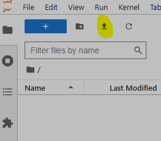

# DSL Course Lambda World 2024

This repository contains the material for the course on *Embedding Domain-Specific Languages in Scala* at Lambda World 2024, delivered by Habla Computing / King Juan Carlos University.

## Contents

#### Module 1. Ad-hoc Embedding
A jq embedding specifically tailored for the fs2 streaming library.

#### Module 2. Domain Abstraction
Abstracting the semantic domain using type classes.

#### Module 3. Dynamic typing
Introducing dynamic typing into the embedding.

#### Module 4. Static Typing
Incorporating static typing into the embedding using Scala 3 match types.


## Installation

**All you need to do is visit [the course website](https://lambdaws.hablapps.com) once it's available and log in to our Jupyter Hub instance using your GitHub account!**

However, if something goes wrong, below are the instructions to install the Scala 3 kernel for Jupyter on your machine, as well as how to run a Docker container with everything preinstalled, if you prefer that option.

## Local Scala 3 Kernel Installation

Additional instructions can be found on [Almond's official website](https://almond.sh).

If you already have Jupyter Notebook or Jupyter Lab installed on your machine, simply run the following commands to install the Scala 3 kernel:


```sh
curl -Lo coursier https://git.io/coursier-cli
chmod +x coursier
./coursier launch --fork almond:0.14.0-RC15 --scala 3.3.0 -- --install --id scala3 --display-name "Scala 3"
rm -f coursier
```

## Docker Container

### Building and Running the Container

In this repository, you will find a `Dockerfile` that builds a modified version of `jupyter/base-notebook`, which includes some utilities and the Scala 3 kernel. To build the container, run the following command:

```sh
docker build -t dslcourse2024 .
```

To run the container, use this command:

```sh
docker run -p 8888:8888 dslcourse2024
```

After running the container, the output will display a URL with a token for localhost. Open the URL in a browser, and you're all set!

### Uploading Files to the Container

Due to the nature of Docker containers, files need to be manually uploaded to the Jupyter Lab instance. To upload a file, click the "Upload" button (see image below) and select the file you want to upload. If you're uploading a zip file, follow the same process. To unzip it, open a terminal session in Jupyter Lab and use the `unzip` command to extract its contents.



### Downloading Files from the Container

To download files from the container, you have two options:

 * For a single file, right-click on the file and select "Download".
 * For a whole directory, first compress it using either `zip` or `tar` in a terminal session, then right-click on the compressed file and select "Download".

## Communication

For any questions, feel free to reach out via email:

 * Juan Manuel Serrano - juanmanuel.serrano@hablapps.com
